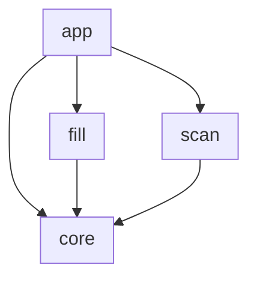
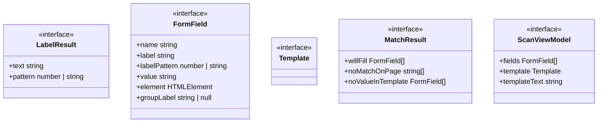
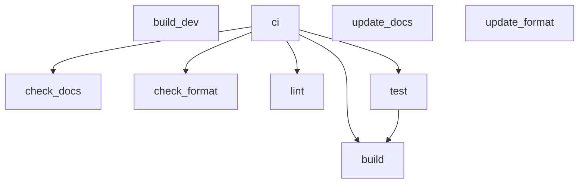

<!-- TOC:START -->
- [form-fill-bookmarklet](#form-fill-bookmarklet)
  - [How It Works](#how-it-works)
    - [Phase 0 — Install the bookmarklet (one time)](#phase-0--install-the-bookmarklet-one-time)
    - [Phase 1 — Capture (Scan mode)](#phase-1--capture-scan-mode)
    - [Phase 2 — Edit offline (between submissions)](#phase-2--edit-offline-between-submissions)
    - [Phase 3 — Refill & resubmit (Fill mode)](#phase-3--refill--resubmit-fill-mode)
  - [Tagged Content Format](#tagged-content-format)
  - [Architecture](#architecture)
    - [Component Diagram](#component-diagram)
    - [Components](#components)
    - [Component Details](#component-details)
      - [app](#app)
      - [core](#core)
      - [fill](#fill)
      - [scan](#scan)
  - [Build Pipeline](#build-pipeline)
  - [Build](#build)
  - [Project Status](#project-status)
<!-- TOC:END -->

# form-fill-bookmarklet

A zero-dependency browser bookmarklet that removes the per-event overhead of
submitting **recurring events** to web calendars that have **no native support
for periodic recurrence** (e.g. CalendarWiz, and many WordPress/Drupal nonprofit
calendar plugins).

Instead of re-typing the same event every week, you capture a filled-out form
**once**, save it as a small text template, and from then on you only edit the
values that change (typically the date) and let the bookmarklet repopulate and
resubmit the form for you.

It installs as nothing more than a browser bookmark, and is designed for users
who are comfortable editing a text file but not writing code.

## How It Works

The tool operates in distinct phases. The bookmarklet itself is a **single**
bookmark with **two auto-detected modes** (Capture / Refill); the surrounding
phases describe the full human workflow.

### Phase 0 — Install the bookmarklet (one time)

Go to the **[install page](https://datalackey.github.io/form-fill-bookmarklet/)**,
copy the bookmarklet text, and save it as the URL of a new browser bookmark.
Step-by-step instructions for Chrome, Firefox, and Safari are on that page.
No installation, extension, or account is required.

### Phase 1 — Capture (Scan mode)

1. Navigate to the calendar's event-submission form.
2. Fill the form out by hand, once, exactly as you want a typical event.
3. Click the bookmarklet. With an empty or non-template clipboard, it runs in
   **Scan mode** and:
   - discovers every form field that has a `name` attribute (only `name` fields
     are sent in the POST — see [CLAUDE.md](./CLAUDE.md) for why not `id`),
   - detects each field's human-readable **label** (four patterns proven in the
     [spike](./spike/README.md)),
   - reads the **value you just entered** for each field,
   - clusters grouped fields (e.g. the day/month/year of a date) under one label,
   - displays a tidy two-column table: **field name → label → current value**,
   - and renders a **tagged-content template** (a `name → value` map) below it.
4. Click **Copy**, then paste the template into a plain text file and save it.

### Phase 2 — Edit offline (between submissions)

For each new occurrence of the event, open your saved template and change **only
the values that differ** — usually just the new event date and/or time. Every
other field stays exactly as captured.

### Phase 3 — Refill & resubmit (Fill mode)

1. Copy the edited tagged content to your clipboard.
2. Open the calendar's submission form and click the bookmarklet. Detecting
   valid template content on the clipboard, it runs in **Fill mode** and:
   - performs a three-way match between template keys and form fields
     (✅ will fill · ⚠️ key with no field on page · ⚠️ field with no template value),
   - fills each matched field and dispatches `input` + `change` events,
   - and, on your confirmation, clicks the form's submit button. There is **no
     auto-submit** — you always confirm first.

> Mode is chosen automatically from the clipboard: valid template ⇒ Fill,
> otherwise ⇒ Scan. One bookmark, no toggling.

## Tagged Content Format

The saved template is **tagged content** — a flat map of form-field `name` to the
value to submit. JSON is the supported format today; YAML is a candidate format
for the same `name → value` shape. Hidden fields are shown in the Scan table for
awareness but are **never** overwritten by the bookmarklet.

## Architecture

### Component Diagram

<!-- UML:components:START -->

<!-- UML:components:END -->

### Components

<!-- UML:components-table:START -->
| Component | Description |
|-----------|-------------|
| [app](#app) | Application shell: the thin orchestration entry point that auto-detects mode from the clipboard (Fill when a valid template is present, otherwise Scan), the React/iframe page-compatibility guards, and the in-page overlay UI that renders the Scan table and Fill summary |
| [core](#core) | Shared foundation layer used by both phases: the TypeScript interfaces (FormField, Template, MatchResult, ScanViewModel), the DOM utility code (field discovery by name attribute, four-pattern label detection, and group clustering, ported from the spike), and the clipboard transport (read/parse/serialize the JSON template) |
| [fill](#fill) | Fill-mode logic: three-way match between a template and the page form, single-field value application with input/change events, and the clipboard-driven fill entry point |
| [scan](#scan) | Scan-mode logic: turns discovered fields into a name to value template and builds the view model (fields plus copyable template text) shown to the user |
<!-- UML:components-table:END -->

### Component Details

<!-- UML:component-details:START -->
#### app
```mermaid
classDiagram
  direction TB
```

#### core


#### fill
```mermaid
classDiagram
  direction TB
```

#### scan
```mermaid
classDiagram
  direction TB
```
<!-- UML:component-details:END -->

## Build Pipeline

The diagram below is generated from the NX target definitions in
[`project.json`](./project.json).

<!-- NX_GRAPH:START -->

<!-- NX_GRAPH:END -->

## Build

```bash
npm install
npm run build        # esbuild bundle + wrap-bookmarklet.js -> dist/bookmarklet.txt
npm run build:dev    # unminified bundle for debugging
npm test             # vitest run
npm run lint         # eslint src tests
npm run format       # prettier --write src tests
npm run docs         # regenerate this README's auto-generated sections
npm run docs:check   # CI drift check (fails if docs are stale)
```

## Project Status

Field discovery and all four label-detection patterns are proven against the
local test server; see the [spike notes](./spike/README.md). Current source lives
in `src/` (`detect.ts`, `index.ts`, `types.ts`); the remaining modules
(`dom.ts`, `clipboard.ts`, `scan.ts`, `fill.ts`, `overlay.ts`) are specified in
[CLAUDE.md](./CLAUDE.md) and not yet implemented.
