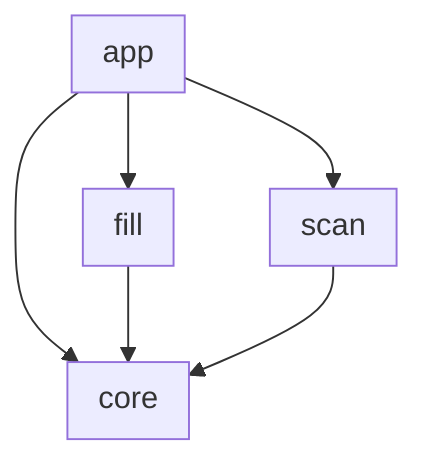
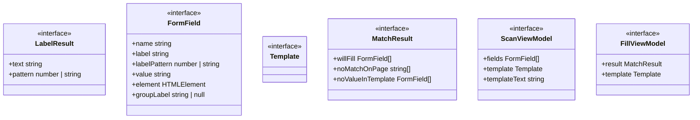
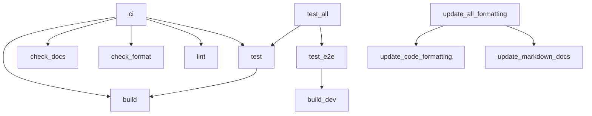

<!-- TOC:START -->
- [form-fill-bookmarklet](#form-fill-bookmarklet)
  - [How It Works](#how-it-works)
    - [Phase 0 — Install](#phase-0--install)
    - [Phase 1 — Scan](#phase-1--scan)
    - [Phase 2 — Edit](#phase-2--edit)
    - [Phase 3 — Fill](#phase-3--fill)
  - [Tagged Content Format](#tagged-content-format)
  - [Architecture](#architecture)
    - [Component Diagram](#component-diagram)
    - [Components](#components)
    - [Component Details](#component-details)
      - [app](#app)
      - [core](#core)
      - [fill](#fill)
      - [scan](#scan)
  - [Build Pipeline](#build-pipeline)
  - [Developer Workflow](#developer-workflow)
  - [Project Status](#project-status)
    - [Known gaps](#known-gaps)
<!-- TOC:END -->

# form-fill-bookmarklet

A zero-dependency browser bookmarklet that removes the repetitive overhead of
submitting **recurring events** to web calendars that have **no native support
for periodic recurrence** (e.g. CalendarWiz, and many WordPress/Drupal nonprofit
calendar plugins).

**Just want to use it?** Go to the
[install page](https://datalackey.github.io/fill-form-bookmarklet/) — no code, no setup.

Instead of re-typing the same event every week, you capture a filled-out form
**once**, save it as a small text template, and from then on you only edit the
values that change (typically the date) and let the bookmarklet repopulate and
resubmit the form for you.

It installs as nothing more than a browser bookmark, and is designed for users
who are comfortable editing a text file but not writing code.

## How It Works

The tool operates in distinct phases. The bookmarklet itself is a **single**
bookmark with **two auto-detected modes** (Capture / Refill); the surrounding
phases describe the full human workflow.

### Phase 0 — Install

Go to the **[install page](https://datalackey.github.io/fill-form-bookmarklet/)**
and drag the **Form Fill** button onto your browser's bookmarks bar. If dragging
isn't an option, the page also offers copy/paste instructions for Chrome, Firefox,
and Safari. No installation, extension, or account required.

### Phase 1 — Scan

1. Navigate to the form and fill it out by hand, exactly as you want a typical event.
2. Click the bookmarklet. With an empty clipboard it runs in **Scan mode**:
    - discovers every form field with a `name` attribute,
    - detects each field's human-readable label,
    - displays a field / label / value table and a JSON template below it.
3. Click **Copy**, paste into a plain text file, and save it.

### Phase 2 — Edit

Open your saved template and change only the values that differ — usually just
the date. Everything else stays as captured.

### Phase 3 — Fill

1. Copy your edited template to the clipboard.
2. Click the bookmarklet. It runs in **Fill mode**:
    - matches template keys to form fields in three categories:
        - ✅ **Will fill** — the template key matches a field `name` on this page;
          the value will be written in.
        - ⚠️ **Stale key** — the template has an entry for a field that no longer
          exists on this page (renamed, removed, or wrong form); it is ignored silently.
        - ⚠️ **No template value** — a field exists on the page but has no entry
          in your template; it is left as-is.
      If there are zero matches the overlay reports an error and no submit button is shown.
    - fills each matched field,
    - shows a **Fill and Submit** button — no auto-submit, you always confirm.

> Mode is chosen from the clipboard automatically: valid template ⇒ Fill, otherwise ⇒ Scan.

## Tagged Content Format

The saved template is **tagged content** — a flat map of form-field `name` to the
value to submit in JSON format. Hidden fields are shown in the Scan table for
awareness but are **never** overwritten by the bookmarklet.

## Architecture

### Component Diagram

<!-- UML:components:START -->

<!-- UML:components:END -->

### Components

<!-- UML:components-table:START -->
| Component | Description |
|-----------|-------------|
| [app](#app) | Orchestration entry point: clipboard-based mode detection (Fill vs Scan), React/iframe compatibility guards, and the in-page overlay UI |
| [core](#core) | Shared foundation: TypeScript interfaces, DOM field discovery with four-pattern label detection, and clipboard transport |
| [fill](#fill) | Fill-mode logic: three-way template-to-form match, field value application with framework events, and fill entry point |
| [scan](#scan) | Scan-mode logic: builds a name→value template from discovered fields and produces the view model for the overlay |
<!-- UML:components-table:END -->

### Component Details

<!-- UML:component-details:START -->
#### app
| Function | Parameters | Returns | Description |
|----------|------------|---------|-------------|
| `isReactForm` | — | boolean | Returns true if any React signal is detected on the page: a [data-reactroot] |
| `isInsideIframe` | — | boolean | Returns true when the bookmarklet is running inside an iframe by comparing |
| `renderScanView` | model: ScanViewModel | string | Render the Scan-mode view: copy/cancel buttons, field table, JSON template block. |
| `renderFillView` | vm: FillViewModel | string | Render the Fill-mode view: match table and action buttons. |
| `showFillOverlay` | vm: FillViewModel<br>onFill: () => void<br>onScanInstead: () => void | void | Render and inject the Fill overlay, then wire up Fill and Submit, Cancel, |
| `showErrorOverlay` | message: string | void | Show an error overlay with a message and a Close button. |
| `showOverlay` | html: string | void | Inject a fixed-position overlay containing the given HTML into the page. |
| `closeOverlay` | — | void | Remove the bookmarklet overlay from the page if it is present. |
| `showScanOverlay` | model: ScanViewModel | void | Render and inject the Scan overlay, then wire up Copy, Cancel, and Escape |

#### core


#### fill
| Function | Parameters | Returns | Description |
|----------|------------|---------|-------------|
| `matchFields` | template: Template<br>fields: FormField[] | MatchResult | Three-way match between a template and the form on the page: |
| `fillField` | field: FormField<br>value: string | void | Apply a single value to a field and fire the events frameworks listen for. |
| `runFill` | raw: string | FillViewModel | null | Fill-mode entry point. |
| `applyFill` | vm: FillViewModel | void | Apply every matched field value from the template to the live DOM elements. |

#### scan
| Function | Parameters | Returns | Description |
|----------|------------|---------|-------------|
| `buildTemplate` | fields: FormField[] | Template | Build a flat name -> value template from discovered fields. |
| `buildScanViewModel` | — | ScanViewModel | Produce the Scan-mode view model: the discovered fields (with current values |
<!-- UML:component-details:END -->

## Build Pipeline

The diagram below is generated from the NX target definitions in
[`project.json`](./project.json).

<!-- NX_GRAPH:START -->

<!-- NX_GRAPH:END -->

## Developer Workflow

```bash
npm install   # first-time setup
```

| What | NX target | npm shortcut |
|------|-----------|--------------|
| Full CI gate (build → unit tests → lint → format check → docs check) | `npx nx ci` | — |
| Production build | `npx nx build` | `npm run build` |
| Dev build (unminified, for manual bookmarklet testing) | `npx nx build-dev` | `npm run build:dev` |
| Unit tests (builds first) | `npx nx test` | `npm test` |
| E2E tests via Playwright (dev-builds first) | `npx nx test-e2e` | `npm run test:e2e` |
| Unit **and** E2E tests | `npx nx test-all` | `npm run test:all` |
| Lint | `npx nx lint` | `npm run lint` |
| Format source code (prettier write) | `npx nx update-code-formatting` | `npm run format` |
| Regenerate README auto-sections | `npx nx update-markdown-docs` | `npm run docs` |
| Format code **and** update docs in one pass | `npx nx update-all-formatting` | — |
| Check format only — fails if files need changes (CI) | `npx nx check-format` | `npm run format:check` |
| Check docs drift only — fails if auto-sections are stale (CI) | `npx nx check-docs` | `npm run docs:check` |
| Watch mode for unit tests during development | — | `npm run test:watch` |

## Project Status

### Known gaps

- Radio group labels: each radio reports its own option text instead of the shared
  group label (locked as `it.todo` in `dom.test.ts`)
- Checkbox and `<select>` filling not yet handled in `fillField()` 
