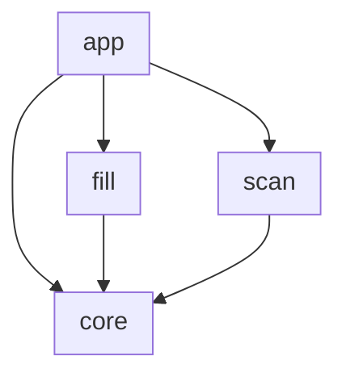
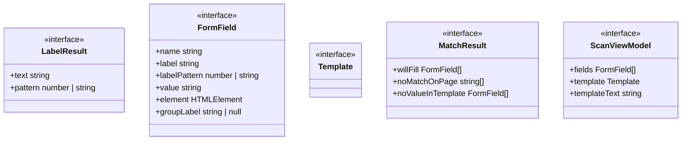
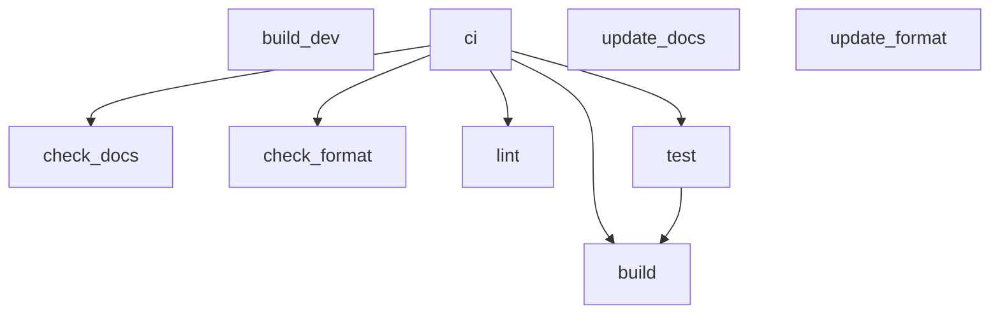

<!-- TOC:START -->

- [form-fill-bookmarklet](#form-fill-bookmarklet)
    - [How It Works](#how-it-works)
        - [Phase 0 — Install](#phase-0--install)
        - [Phase 1 — Scan](#phase-1--scan)
        - [Phase 2 — Edit](#phase-2--edit)
        - [Phase 3 — Fill](#phase-3--fill)
    - [Tagged Content Format](#tagged-content-format)
    - [Architecture](#architecture)
        - [Component Diagram](#component-diagram)
        - [Components](#components)
        - [Component Details](#component-details)
            - [app](#app)
            - [core](#core)
            - [fill](#fill)
            - [scan](#scan)
    - [Build Pipeline](#build-pipeline)
    - [Build](#build)
    - [Project Status](#project-status)
      <!-- TOC:END -->

# form-fill-bookmarklet

A zero-dependency browser bookmarklet that removes the repetitive overhead of
submitting **recurring events** to web calendars that have **no native support
for periodic recurrence** (e.g. CalendarWiz, and many WordPress/Drupal nonprofit
calendar plugins).

**Just want to use it?** Go to the [install page](https://datalackey.github.io/fill-form-bookmarklet/) — no code, no setup.

Instead of re-typing the same event every week, you capture a filled-out form
**once**, save it as a small text template, and from then on you only edit the
values that change (typically the date) and let the bookmarklet repopulate and
resubmit the form for you.

It installs as nothing more than a browser bookmark, and is designed for users
who are comfortable editing a text file but not writing code.

## How It Works

The tool operates in distinct phases. The bookmarklet itself is a **single**
bookmark with **two auto-detected modes** (Capture / Refill); the surrounding
phases describe the full human workflow.

### Phase 0 — Install

Go to the **[install page](https://datalackey.github.io/fill-form-bookmarklet/)**,
copy the bookmarklet text, and save it as a browser bookmark.
Step-by-step instructions for Chrome, Firefox, and Safari are on that page.
No installation, extension, or account required.

### Phase 1 — Scan

1. Navigate to the form and fill it out by hand, exactly as you want a typical event.
2. Click the bookmarklet. With an empty clipboard it runs in **Scan mode**:
    - discovers every form field with a `name` attribute,
    - detects each field's human-readable label,
    - displays a field / label / value table and a JSON template below it.
3. Click **Copy**, paste into a plain text file, and save it.

### Phase 2 — Edit

Open your saved template and change only the values that differ — usually just
the date. Everything else stays as captured.

### Phase 3 — Fill

1. Copy your edited template to the clipboard.
2. Click the bookmarklet. It runs in **Fill mode**:
    - matches template keys to form fields (✅ will fill · ⚠️ stale key · ⚠️ no template value),
    - fills each matched field,
    - shows a **Fill and Submit** button — no auto-submit, you always confirm.

> Mode is chosen from the clipboard automatically: valid template ⇒ Fill, otherwise ⇒ Scan.

## Tagged Content Format

The saved template is **tagged content** — a flat map of form-field `name` to the
value to submit. JSON is the supported format today; YAML is a candidate format
for the same `name → value` shape. Hidden fields are shown in the Scan table for
awareness but are **never** overwritten by the bookmarklet.

## Architecture

### Component Diagram

<!-- UML:components:START -->



<!-- UML:components:END -->

### Components

<!-- UML:components-table:START -->

| Component     | Description                                                                                                                                                                                                                                                                                                                         |
| ------------- | ----------------------------------------------------------------------------------------------------------------------------------------------------------------------------------------------------------------------------------------------------------------------------------------------------------------------------------- |
| [app](#app)   | Application shell: the thin orchestration entry point that auto-detects mode from the clipboard (Fill when a valid template is present, otherwise Scan), the React/iframe page-compatibility guards, and the in-page overlay UI that renders the Scan table and Fill summary                                                        |
| [core](#core) | Shared foundation layer used by both phases: the TypeScript interfaces (FormField, Template, MatchResult, ScanViewModel), the DOM utility code (field discovery by name attribute, four-pattern label detection, and group clustering, ported from the spike), and the clipboard transport (read/parse/serialize the JSON template) |
| [fill](#fill) | Fill-mode logic: three-way match between a template and the page form, single-field value application with input/change events, and the clipboard-driven fill entry point                                                                                                                                                           |
| [scan](#scan) | Scan-mode logic: turns discovered fields into a name to value template and builds the view model (fields plus copyable template text) shown to the user                                                                                                                                                                             |

<!-- UML:components-table:END -->

### Component Details

<!-- UML:component-details:START -->

#### app

```mermaid
classDiagram
  direction TB
```

#### core



#### fill

```mermaid
classDiagram
  direction TB
```

#### scan

```mermaid
classDiagram
  direction TB
```

<!-- UML:component-details:END -->

## Build Pipeline

The diagram below is generated from the NX target definitions in
[`project.json`](./project.json).

<!-- NX_GRAPH:START -->



<!-- NX_GRAPH:END -->

## Build

```bash
npm install
npm run build        # esbuild bundle + wrap-bookmarklet.js -> dist/bookmarklet.txt
npm run build:dev    # unminified bundle for debugging
npm test             # vitest run
npm run lint         # eslint src tests
npm run format       # prettier --write src tests
npm run docs         # regenerate this README's auto-generated sections
npm run docs:check   # CI drift check (fails if docs are stale)
```

## Project Status

### Done

All core modules are implemented and the bookmarklet builds and deploys:

- `src/core/types.ts` — shared interfaces (`FormField`, `Template`, `MatchResult`, `ScanViewModel`)
- `src/core/dom.ts` — `discoverFields()`, `detectLabel()` (four patterns), `detectGroups()`
- `src/core/clipboard.ts` — `readClipboard()`, `parseTemplate()`, `serializeTemplate()`
- `src/scan/scan.ts` — `buildTemplate()`, `buildScanViewModel()`
- `src/fill/fill.ts` — `matchFields()`, `fillField()`, `runFill()`
- `src/app/detect.ts` — `isReactForm()`, `isInsideIframe()`
- `src/app/overlay.ts` — `showOverlay()`, `renderScanView()`, `renderFillView()` (basic; manual-tested only)
- `src/app/index.ts` — orchestration entry point
- `tests/detect.test.ts` (4 passing), `tests/dom.test.ts` (16 passing + 1 todo)
- GitHub Actions CI/CD → deploys install page to GitHub Pages on every push to `main`

All four label-detection patterns are proven against the local test server; see the [spike notes](./spike/README.md).

### Known gaps

- Overlay UI is basic — full scan table layout and fill-and-submit confirmation not yet polished
- Radio group labels: each radio reports its own option text instead of the shared group label (spike carry-forward, locked as `it.todo` in `dom.test.ts`)
- `clipboard.test.ts`, `scan.test.ts`, `fill.test.ts` not yet written
- Checkbox and `<select>` filling not yet handled in `fillField()` (per CLAUDE.md)
